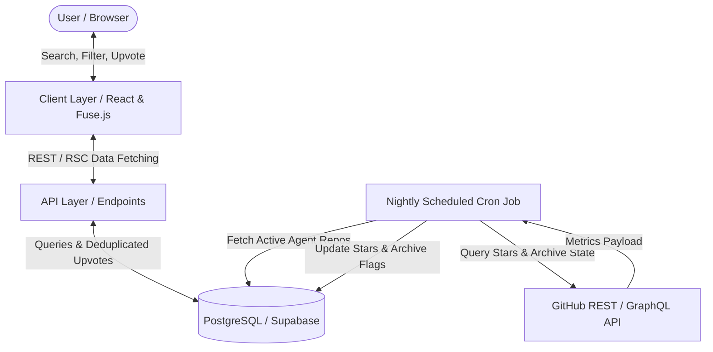
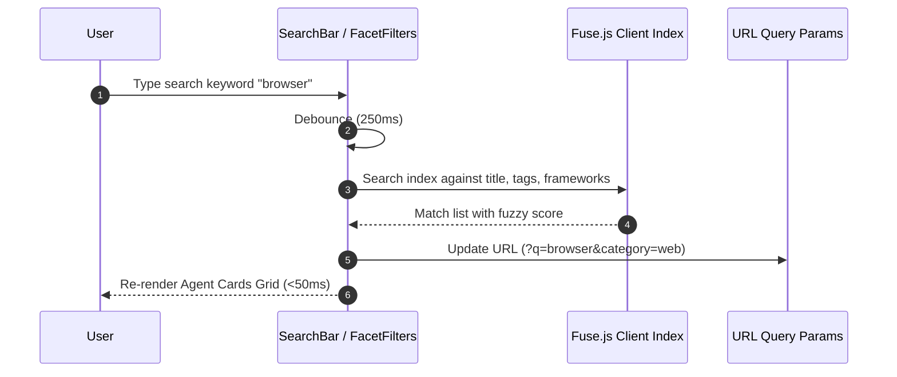

# Agents Directory & Profiles — Architecture

## Overview

The Agents Directory & Profile feature serves as the core catalog of AgentHub. It encompasses a multi-faceted search interface, deep technical telemetry profiles, an exponential time-decay ranking algorithm, deduplicated community voting, and automated GitHub repository synchronization.



---

## Database Architecture & Data Schema

Data persistence is managed via a relational PostgreSQL model.

### 1. `agents` Table

Stores verified and pending agent records with comprehensive technical metadata.

```sql
CREATE TABLE agents (
    id UUID PRIMARY KEY DEFAULT gen_random_uuid(),
    slug VARCHAR(120) NOT NULL UNIQUE,
    title VARCHAR(150) NOT NULL,
    tagline VARCHAR(255) NOT NULL,
    summary VARCHAR(120) NOT NULL,
    description_markdown TEXT NOT NULL,
    logo_url TEXT NOT NULL,
    website_url TEXT NOT NULL,
    repository_url TEXT,
    github_stars INTEGER DEFAULT 0 NOT NULL,
    category_id UUID NOT NULL REFERENCES categories(id) ON DELETE RESTRICT,
    deployment_targets TEXT[] NOT NULL DEFAULT '{}',
    llm_backends TEXT[] NOT NULL DEFAULT '{}',
    framework VARCHAR(100),
    is_open_source BOOLEAN NOT NULL DEFAULT false,
    is_mcp_compliant BOOLEAN NOT NULL DEFAULT false,
    hardware_requirements TEXT,
    terminal_setup_script TEXT,
    strengths TEXT[],
    known_edge_cases TEXT[],
    upvotes_count INTEGER DEFAULT 0 NOT NULL,
    lifecycle_state VARCHAR(20) NOT NULL DEFAULT 'pending' CHECK (lifecycle_state IN ('pending', 'approved', 'rejected')),
    is_archived BOOLEAN NOT NULL DEFAULT false,
    submitter_email VARCHAR(255) NOT NULL,
    created_at TIMESTAMPTZ NOT NULL DEFAULT NOW(),
    updated_at TIMESTAMPTZ NOT NULL DEFAULT NOW()
);

-- Performance Indexes
CREATE INDEX idx_agents_slug ON agents(slug);
CREATE INDEX idx_agents_category ON agents(category_id);
CREATE INDEX idx_agents_state_upvotes ON agents(lifecycle_state, upvotes_count DESC);
CREATE INDEX idx_agents_created_at ON agents(created_at DESC);
```

### 2. `upvotes` Table

Guarantees strict deduplication by binding each vote to either an authenticated user or a hashed digital footprint.

```sql
CREATE TABLE upvotes (
    id UUID PRIMARY KEY DEFAULT gen_random_uuid(),
    agent_id UUID NOT NULL REFERENCES agents(id) ON DELETE CASCADE,
    user_id UUID,
    digital_fingerprint_hash VARCHAR(64),
    created_at TIMESTAMPTZ NOT NULL DEFAULT NOW(),
    CONSTRAINT chk_voter_identity CHECK (
        (user_id IS NOT NULL AND digital_fingerprint_hash IS NULL) OR
        (user_id IS NULL AND digital_fingerprint_hash IS NOT NULL)
    ),
    CONSTRAINT uq_agent_user UNIQUE (agent_id, user_id),
    CONSTRAINT uq_agent_fingerprint UNIQUE (agent_id, digital_fingerprint_hash)
);

CREATE INDEX idx_upvotes_agent_created ON upvotes(agent_id, created_at DESC);
```

### 3. `categories` Table

Reference table containing standard functional domains.

```sql
CREATE TABLE categories (
    id UUID PRIMARY KEY DEFAULT gen_random_uuid(),
    slug VARCHAR(60) NOT NULL UNIQUE,
    title VARCHAR(100) NOT NULL,
    description TEXT NOT NULL,
    icon_token VARCHAR(50) NOT NULL,
    display_order INTEGER NOT NULL DEFAULT 0
);
```

---

## Ranking Algorithm & Background Sync

### 1. Dynamic Exponential Time-Decay Ranking

To prevent early established agents from monopolizing visibility, trending scores are computed dynamically over a rolling 7-day window:

$$\text{Score} = \frac{\text{Upvotes}_{7\text{d}} + 1}{(\text{Age}_{\text{hours}} + 2)^{1.5}}$$

Where:
- $\text{Upvotes}_{7\text{d}}$: Number of validated upvotes recorded in the preceding 168 hours (7 days).
- $\text{Age}_{\text{hours}}$: Elapsed hours since initial approval / creation in the catalog.
- $+1$: Laplace smoothing to ensure newly added records possess a baseline non-zero discovery score.
- $+2$: Temporal stabilization buffer preventing asymptotic division spikes for newly submitted agents.
- Power parameter ($1.5$): Applies accelerated gravity decay to older engagement spikes.

### 2. Scheduled Synchronization Cron

- **Schedule**: Nightly routine (`0 2 * * *` UTC).
- **Execution Workflow**:
  1. Query all records where `lifecycle_state = 'approved'` and `repository_url IS NOT NULL`.
  2. Batch query the GitHub API (GraphQL / REST) using rotating service tokens.
  3. Extract current star counts, repository fork volume, and repository archival status (`is_archived`).
  4. Perform atomic database updates:
     - Update `github_stars = :stars`.
     - If repository is archived upstream, set `is_archived = true` to demote or hide the listing from default search views.

---

## Frontend Architecture & State Management

### Client-Side Search & Filtering Pipeline



- **Fuse.js Indexing**: Pre-built in-memory search index of active agents loaded on initialization. Supports fuzzy matching across `title`, `tagline`, `framework`, and `tags` with threshold $0.35$.
- **URL Synchronization**: Selected category, runtime, monetization, and query terms are serialized to URL query parameters (`?q=...&category=...&runtime=...`) to ensure full bookmarkability and shareability.
- **Optimistic Upvote Interaction**: Clicking upvote instantly increments the counter and updates button styling locally while dispatching the background API request. If the backend reports duplicate voting (`409 Conflict`), the UI rolls back to previous state and alerts the user.

---

## API Surface

| Method | Endpoint | Description | Auth / Identity |
|--------|----------|-------------|-----------------|
| `GET` | `/api/agents` | Paginated/filtered catalog with ranking scores | Public |
| `GET` | `/api/agents/{slug}` | Detailed profile, telemetry grid, edge cases | Public |
| `POST` | `/api/agents/{id}/upvote` | Cast an upvote for an agent | Auth Bearer OR `X-Fingerprint` |
| `DELETE` | `/api/agents/{id}/upvote` | Revoke a previous upvote | Auth Bearer OR `X-Fingerprint` |
| `GET` | `/api/categories` | Reference list of categories and icons | Public |
| `GET` | `/api/agents/{slug}/alternatives` | 3–5 contextual alternatives in same category | Public |

