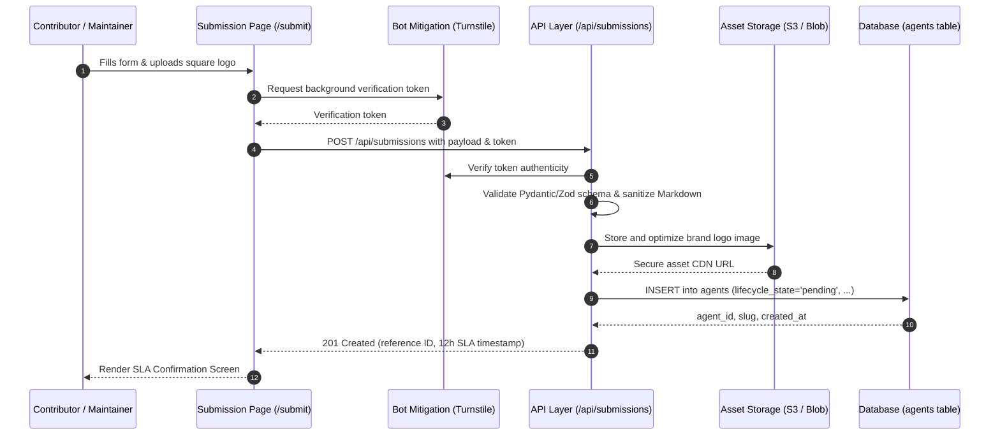
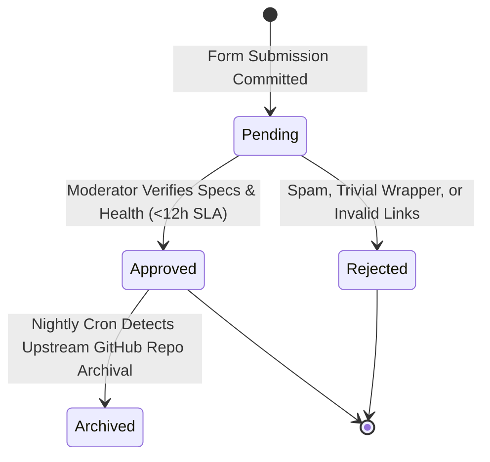

# Community Submission Portal — Architecture

## Overview

The Community Submission Portal manages the intake pipeline for new AI agents. It ensures incoming submissions are verified through client-side validation, background bot mitigation, server schema sanitization, and structured storage under a `pending` moderation lifecycle.



---

## Moderation Lifecycle State Machine



---

## Data Validation & Schema

### Input Payload (`AgentSubmissionSchema`)

```typescript
interface AgentSubmissionPayload {
  title: string;              // 3..150 chars, trimmed
  tagline: string;            // 10..255 chars
  summary: string;            // <= 120 chars (for directory card preview)
  description_markdown: string; // Markdown product brief, sanitized against XSS
  website_url: string;        // Valid HTTPS URL
  repository_url?: string;    // Valid HTTPS Git repository URL
  category_id: string;        // UUID referencing categories table
  deployment_targets: Array<"cloud" | "cli" | "docker" | "ide_extension">;
  llm_backends: string[];     // e.g. ["claude-3-5-sonnet", "gpt-4o", "llama-3"]
  framework?: string;         // e.g. "LangGraph", "CrewAI", "AutoGen", "Custom"
  is_open_source: boolean;
  is_mcp_compliant: boolean;
  hardware_requirements?: string;
  terminal_setup_script?: string;
  submitter_email: string;    // Valid email format
  turnstile_token: string;    // Cloudflare Turnstile token for verification
}
```

### Security & Sanitization

1. **Bot Mitigation**: Submissions require a valid Turnstile token checked against the provider verification endpoint. Rapid repeated submissions from the same IP are rate-limited via a token-bucket algorithm (maximum 5 submissions per hour per IP).
2. **Markdown XSS Cleansing**: Body text is sanitized via HTML sanitizers (e.g. DOMPurify or `bleach`) stripping unsafe scripts, iframes, and raw HTML attributes before storage.
3. **Asset Processing**: Uploaded logos are checked for MIME type (`image/png`, `image/webp`, `image/svg+xml`), scanned for malicious payload chunks, resized/compressed to standard 256x256 WebP, and stored in object storage.

---

## API Surface

| Method | Endpoint | Request Body | Response Code | Description |
|--------|----------|--------------|---------------|-------------|
| `POST` | `/api/submissions` | `AgentSubmissionPayload` | `201 Created` / `400` / `422` | Submit new agent for moderation review |
| `POST` | `/api/submissions/upload-logo` | `multipart/form-data` | `200 OK` (returns CDN URI) | Pre-upload and validate logo asset |
| `GET` | `/api/submissions/{id}/status` | None | `200 OK` (`pending` / `approved` / `rejected`) | Check submission status via token/ID |

